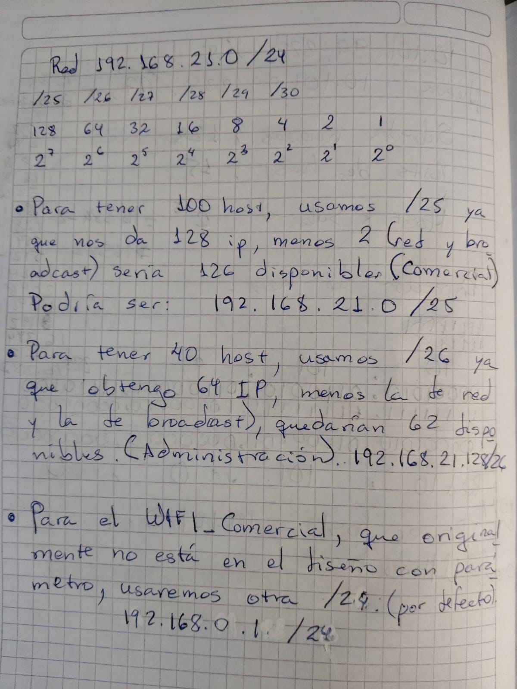
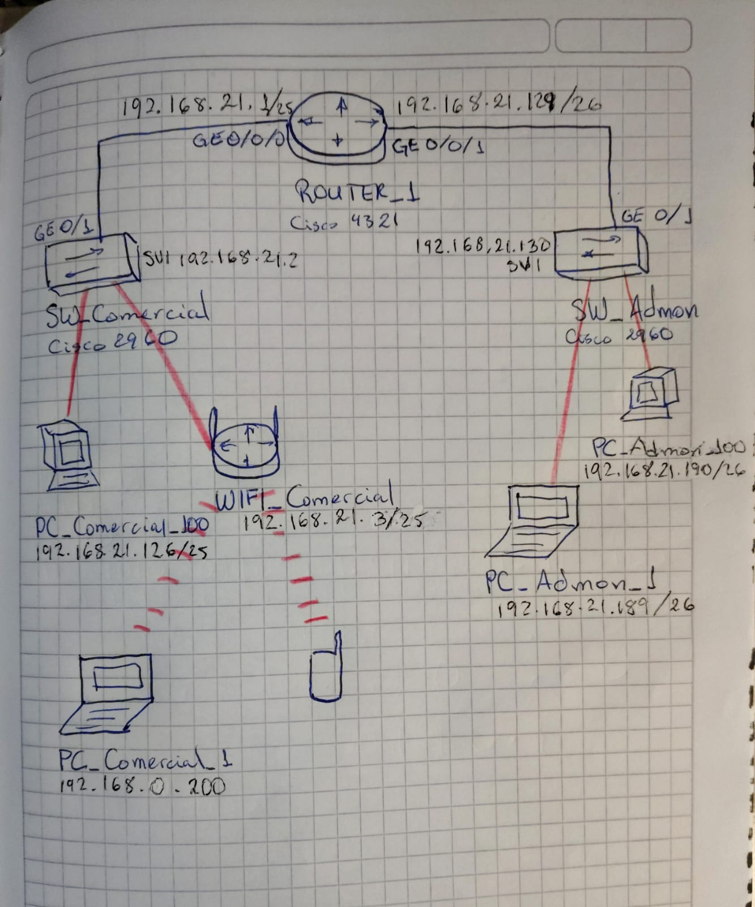
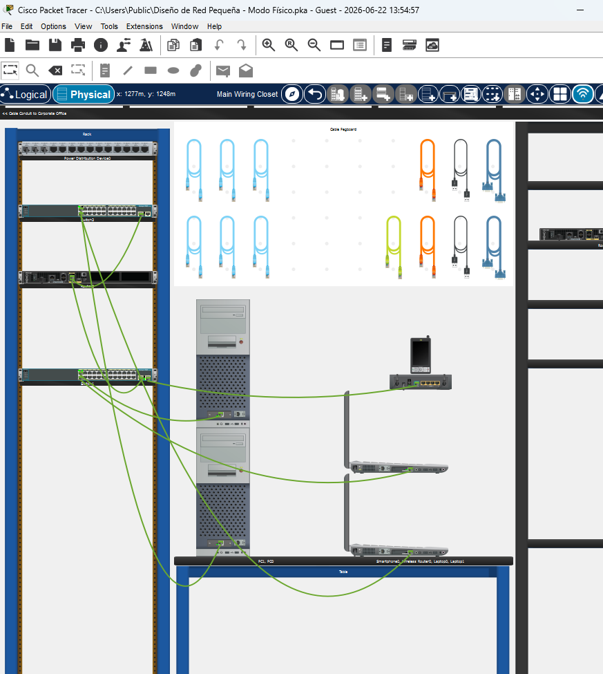
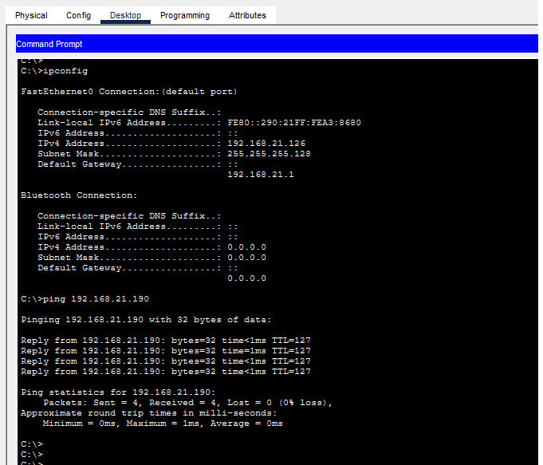
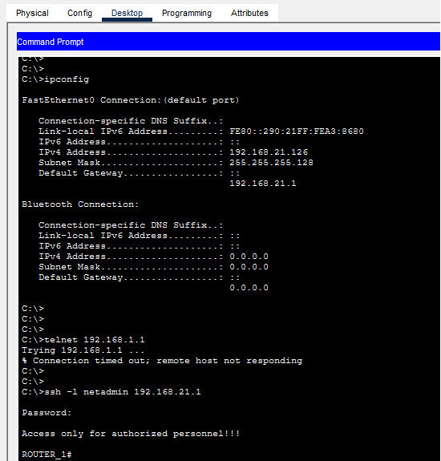
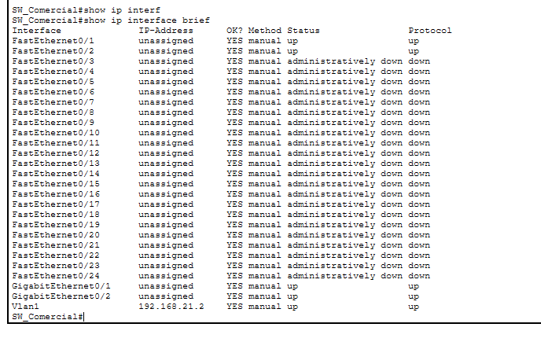
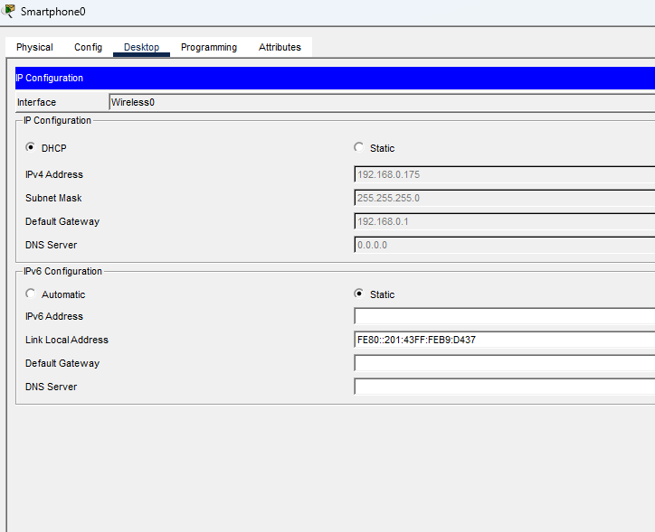
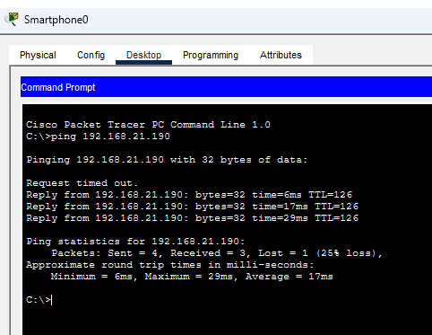

# Implementación de Infraestructura de Red y Seguridad Perimetral para Sucursal XYZ 🌐

## 📝 Descripción del Proyecto
Este laboratorio práctico simula el diseño y despliegue de la infraestructura de red local para una nueva sucursal de la empresa XYZ. El objetivo principal es segmentar la red asignada (`192.168.21.0/24`) utilizando **VLSM (Variable Length Subnet Mask)** para optimizar el direccionamiento IP de las áreas de **Administración** y **Comercial**, aplicando estrictas políticas de endurecimiento (*hardening*) y seguridad en los dispositivos de borde y distribución Cisco.

### 🧠 Diseño Lógico y Memoria de Cálculo (VLSM)
Para este diseño y evitar el desperdicio de direcciones IP decidí implementar VLSM para segmentar el bloque `192.168.21.0/24` de manera eficiente. Antes de realizar el montaje en el software de simulación, realicé el análisis binario y el cálculo manual de las necesidades de hosts para asegurar el máximo aprovechamiento del direccionamiento IP asignado:

### 🗺️ Diagrama de Arquitectura y Topología Lógica
Con el direccionamiento calculado, diseñé la topología lógica definiendo las interfaces exactas (`GigabitEthernet`) y los puntos de demarcación para la red cableada e inalámbrica:

## 🛠️ Requerimientos del Diseño

### 1. Topología Física
La red está compuesta por la siguiente arquitectura de hardware en Cisco Packet Tracer:
* **Core/Routing:** 1x Router Cisco 4321 (`ROUTER_1`)
* **Switching:** 2x Switches Cisco 2960 (`SW_Admon` y `SW_Comercial`)
* **Wireless:** 1x Router Inalámbrico Doméstico (`WIFI_Comercial`)
* **End Devices:** PCs de escritorio, Laptops y dispositivos móviles corporativos.

### 2. Cuadro de Direccionamiento Lógico (VLSM)

| Subred / Área | Requerimiento | Dirección de Red | Máscara de Red | Gateway (R1) | Switch (VLAN 1) | Dispositivos Especiales |
| :--- | :--- | :--- | :--- | :--- | :--- | :--- |
| **Comercial** | 100 Hosts | `192.168.21.0` | `255.255.255.128 (/25)` | `192.168.21.1` | `192.168.21.2` | `WIFI_Comercial (WAN): 192.168.21.3`   `PC_Comercial_100: 192.168.21.126` |
| **Administración** | 40 Hosts | `192.168.21.128` | `255.255.255.192 (/26)` | `192.168.21.129` | `192.168.21.130` | `PC_Admon_100: 192.168.21.190`   `PC_Admon_1: 192.168.21.189` |

---

## 🔒 Políticas de Seguridad e Inmunización Aplicadas
Para cumplir con los estándares de auditoría de la empresa, se configuraron los siguientes parámetros en el CLI de Cisco:

* **Control de Acceso Seguro:** Desactivación de Telnet, permitiendo de forma exclusiva conexiones cifradas mediante **SSHv2** con una política de longitud mínima de contraseña de 10 caracteres.
* **Cifrado de Credenciales:** Uso de algoritmos de encriptación para asegurar las contraseñas del modo EXEC privilegiado y de consola en texto plano.
* **Mitigación de Vectores de Ataque:** Desactivación de la búsqueda de DNS (`no ip domain-lookup`) para prevenir retrasos por errores de digitación y apagado administrativo preventivo (`shutdown`) de todas las interfaces de los switches que no se encuentran en uso.
* **Mensajes de Advertencia:** Configuración de un Banner MOTD legal restrictivo.

---

## 📸 Evidencias de Funcionamiento e Interconexión

### Diagrama de la Topología General

### Pruebas de Conectividad Fin a Fin (End-to-End)

* **Ping exitoso desde el área de Comercial hacia Administración:**

### Pruebas de Endurecimiento (Hardening) y Acceso Remoto
* **Verificación de SSH desde un PC al Router:**

* **Puertos inactivos asegurados:**

### 📶 Verificación de la Red Inalámbrica (WIFI_Comercial)
Para el área comercial se desplegó un acceso inalámbrico aislado seguro. Las siguientes evidencias confirman el correcto funcionamiento del direccionamiento dinámico y la salida a la red corporativa:

* **Asignación IP por DHCP en cliente inalámbrico:**

* **Prueba de conectividad (Ping) desde la red WiFi hacia el área de Administración:**

